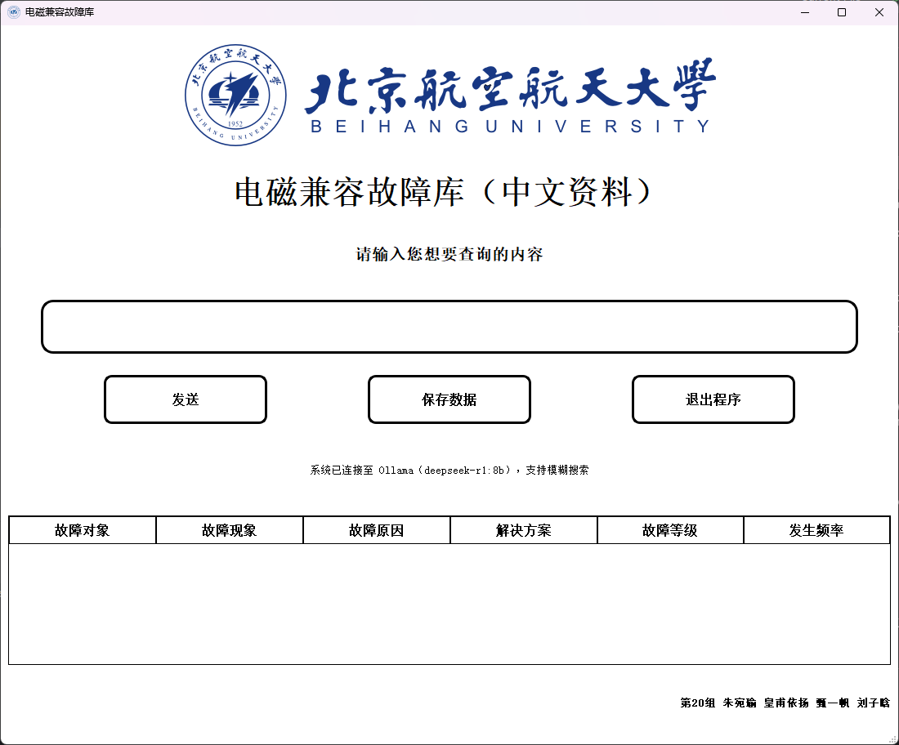
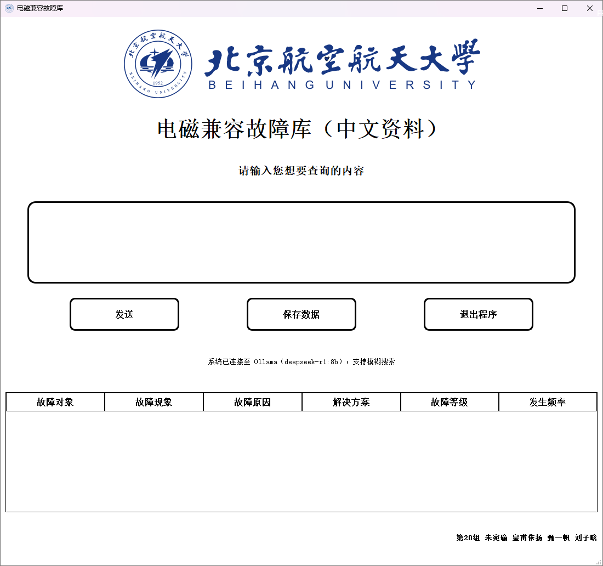

<h1 align="center">Electromagnetic Compatibility Fault Database (Chinese Corpus)</h1>


> [!NOTE]
>
> **Vision**: build an **EMC fault database AGENT** based on **RAG (Retrieval-Augmented Generation) and a long-term memory system** — following the "data source → knowledge processing → structured storage → functional iteration" pipeline, distilling scattered, unstructured EMC fault material into structured, reusable fault knowledge, with LLM-driven intelligent query, fault-diagnosis assistance, dynamic incremental knowledge building, and update suggestions.
>
> **Current status**: the foundation is complete — data collected from three sources (papers, web, online LLMs), cleaned, LLM-extracted, and deduplicated into 151 published entries; the PyQt6 query application and early ChromaDB RAG code are preserved as experiments. The formal dataset validation and repeatable vector-index entries are `scripts/data/validate_dataset.py` and `scripts/data/build_vector_index.py`; the Web frontend, Python backend, and Agent runtimes are being rebuilt under the new architecture.

<p align="center">
  <strong>English</strong>
  &nbsp;·&nbsp;
  <a href="./README.md">简体中文</a>
  &nbsp;·&nbsp;
  <a href="./docs/research/项目过程与细节记录.md">Project notes (Chinese)</a>
</p>


<p align="center">
  <a href="./LICENSE"></a>
  <a href=".github/workflows/ci.yml"></a>
  <a href="https://www.python.org/"></a>
  <a href="https://github.com/JesonChou/EMC-fault-probe/stargazers"></a>
  <a href="https://github.com/JesonChou/EMC-fault-probe/graphs/contributors"></a>
  <a href="https://github.com/JesonChou/EMC-fault-probe/issues"></a>
  <a href="./CONTRIBUTING.md"></a>
<h3 align="center">Type a Chinese fault description, get "fault → cause → solution" instantly</h3>
<p align="center">Fault cases are collected from papers, web resources, and online LLMs, cleaned and structured by LLM extraction into ~200 entries; the desktop app supports exact search, LLM semantic expansion, and Excel export.</p>

<p align="center">
  
</p>
<p align="center">
  
  
</p>


> [!NOTE]
>
> Without a local Ollama model the app gracefully falls back to plain keyword search — all core features keep working.

## Install

Requires Python 3.10+. Works on Windows / Linux / macOS.

```powershell
python -m pip install -r requirements.txt
 python experiments/desktop/pyqt6_app/EMC_Fault_Database_Test.py
```

> [!NOTE]
> The experiment loads `data/published/v1/data_1.json` and `data/published/v1/data_2.json`, deduplicating by full entry on load. Historical processing files under `data/processed/` are retained for traceability only.

Run tests:

```powershell
python -m pip install -r requirements-dev.txt pytest
 python -m pytest experiments/desktop/pyqt6_app/tests/ -v
 python -m pytest packages/emc-core-py/tests/ -v
```

Build a Windows executable (output to the untracked `artifacts/` directory to avoid overwriting historical release files):

```powershell
python -m pip install -r requirements-dev.txt
 cd experiments/desktop/pyqt6_app
 pyinstaller --clean --noconfirm --distpath ..\..\..\artifacts\dist --workpath ..\..\..\artifacts\build EMC_Fault_Database_Test.spec
```

## Configuration

Local semantic expansion is optional, powered by [Ollama](https://ollama.com/).

| Setting | Description |
|:-:|:-:|
| Ollama service | Install and start Ollama; `ollama run deepseek-r1:8b` pulls the default model |
| `EMC_OLLAMA_MODEL` | Environment variable selecting another installed model (default `deepseek-r1:8b`) |

```cmd
ollama run deepseek-r1:8b
```

```powershell
$env:EMC_OLLAMA_MODEL = "qwen2.5:7b"   # optional, overrides the default model
```

On startup the app probes the Ollama service and available models; when detected, the user query is expanded into related keywords by the LLM before searching, improving recall of fuzzy queries. Model-finetuning experiments and prompt details: [docs/research/项目过程与细节记录.md](./docs/research/项目过程与细节记录.md).

## What makes it different

The data is the core asset: instead of relying on an existing dataset, fault cases are collected from three sources (journal papers & industry reports, web resources, online LLM Q&A) and run through a full pipeline of collect → clean → LLM structured extraction → merge & dedupe → store, resulting in a structured entry base where fault phenomenon, cause, and solution map one-to-one — paired with a desktop app that puts it to use.

- Six structured fields per entry: object / phenomenon / cause / solution / severity / frequency
- Deduplication by full entry, unique search results
- `QTableView` tabular display, one-click `.xlsx` export
- LLM query expansion runs in a background thread (`QThread`) without blocking the UI

## How it compares

|                                | Keyword only | Keyword + LLM expansion |
|--------------------------------|:---:|:---:|
| Exact-match queries            | yes | yes |
| Fuzzy / synonymous semantics   | —   | yes |
| Local deployment, data stays on machine | yes | yes |
| Works offline (no Ollama)      | yes | falls back to keyword |
| Extra dependencies             | none | Ollama + local model |

## Documentation

- [**Project notes**](./docs/research/项目过程与细节记录.md) (中文) — full development record: data collection, preprocessing, LLM extraction, database construction, implementation and code walkthrough
- [**Agent tool-calling record**](./docs/research/1-agent-tool-calling.md) — Prompt and native tool-calling experiments
- [**README.md**](./README.md) — 简体中文版
- [**CONTRIBUTING.md**](./CONTRIBUTING.md) — contribution guide (GitHub Flow)
- [**LICENSE**](./LICENSE) — MIT License

## Community

This project is open to collaboration following community conventions:

- Report bugs or feature requests → [GitHub Issues](https://github.com/JesonChou/EMC-fault-probe/issues)
- Submit code → follow [CONTRIBUTING.md](./CONTRIBUTING.md): create a feature branch from `main`, finish your work, open a Pull Request
- Quality gates → `ruff check apps packages experiments scripts` clean, tests for new features; CI runs lint + pytest on Ubuntu / Windows

## Non-goals

This project is deliberately scoped; the following are out of scope:

- **Multilingual corpus.** Chinese materials only; English EMC corpus is a possible future direction.
- **Mobile clients.** The current target includes a Web frontend, Python backend, and Windows desktop clients; mobile is out of scope.
- **Large database systems.** JSON file storage already satisfies structured queries over ~200 entries; MySQL / MongoDB are not introduced.
- **Commercialization.** MIT licensed; for commercial needs, contact the developers directly.

## Support

If this project helps you, a star is appreciated. For questions, check the [Issues](https://github.com/JesonChou/EMC-fault-probe/issues) first or open a new one.

## Acknowledgments

Acknowledgments:

- [**JesonChou**](https://github.com/JesonChou)
- [**eternalweightlessness**](https://github.com/eternalweightlessness)

- [**421951168-cyber**](https://github.com/421951168-cyber)
- [**JGCF-XDB**](https://github.com/JGCF-XDB)

Thanks also to [Ollama](https://ollama.com/) for the local LLM platform, [PyQt](https://www.riverbankcomputing.com/software/pyqt/) for the desktop framework, and the online LLMs (DeepSeek, ChatGPT) and course materials that provided data support.

<p align="center">
  <a href="https://github.com/JesonChou/EMC-fault-probe/graphs/contributors">
    
  </a>
</p>

---

<p align="center">
  <sub>MIT — see <a href="./LICENSE">LICENSE</a></sub>
  <br/>
  <sub>Built by group 20 at <a href="https://github.com/JesonChou/EMC-fault-probe">JesonChou/EMC-fault-probe</a></sub>
</p>
