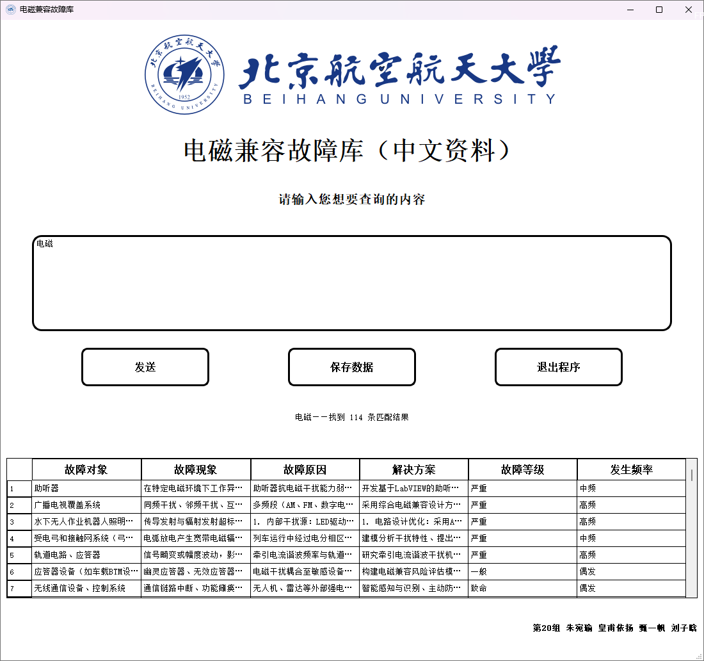

<h1 align="center">EMC Fault Probe Agent</h1>


> [!NOTE]
>
> **项目愿景**：构建一个基于 **RAG（检索增强生成）与长期记忆系统**的电磁兼容故障库 **AGENT** —— 沿"数据来源 → 知识加工 → 结构化存储 → 功能迭代"主线，将分散、非结构化的 EMC 故障资料沉淀为结构化、可复用的故障知识体系，由 LLM 驱动实现智能查询、故障诊断辅助、知识动态增量构建与更新提示。
>
> **当前进度**：151 条 EMC 案例数据和 Agent/RAG 实验已完成，正在重构为“本地 Ollama + 工具调用 + RAG + 会话桌面端”的轻量正规 Agent。正式数据校验与可重复向量索引入口分别为 `scripts/data/validate_dataset.py` 和 `scripts/data/build_vector_index.py`。旧 PyQt6 数据库查询程序仅作为历史实验保留，其表格与 Excel 导出不属于新 Agent 的迁移目标。

<p align="center">
  <strong>简体中文</strong>
  &nbsp;·&nbsp;
  <a href="./README.en.md">English</a>
  &nbsp;·&nbsp;
  <a href="./docs/research/项目过程与细节记录.md">项目过程与细节记录</a>
</p>

<p align="center">
  <a href="./LICENSE"></a>
  <a href=".github/workflows/ci.yml"></a>
  <a href="https://www.python.org/"></a>
  <a href="https://github.com/JesonChou/EMC-fault-probe/stargazers"></a>
  <a href="https://github.com/JesonChou/EMC-fault-probe/graphs/contributors"></a>
  <a href="https://github.com/JesonChou/EMC-fault-probe/issues"></a>
  <a href="./CONTRIBUTING.md"></a>
</p>
<h3 align="center">对话式 EMC 诊断 · 本地 RAG · 工具调用</h3>
<p align="center">向 Agent 描述电磁兼容问题；模型按需检索本地案例资料，并以流式对话给出分析、排查步骤和整改建议。</p>

## 运行正式 Agent

要求 Python 3.11+、本地 [Ollama](https://ollama.com/) 以及
`qwen3.5:9b-q4_K_M`、`nomic-embed-text` 模型。首次运行先安装各工作区包并构建
正式向量索引：

```powershell
python -m pip install -r requirements-dev.txt
python -m pip install -e packages/emc-core-py -e packages/emc-runtime-local-py `
  -e integrations -e apps/backend -e apps/desktop-agent
python scripts/data/build_vector_index.py
```

在两个 PyCharm Run Configuration 或终端中分别启动：

```powershell
# 后端：支持保存后自动重载
python -m emc_backend.main --reload

# 桌面端：会话、RAG 工具卡、思考折叠与流式回答
python -m emc_desktop_agent.main
```

后端入口为 `emc_backend.main`，桌面入口为 `emc_desktop_agent.main`。更详细的
PyCharm 配置和热更新方法见 `apps/backend/README.md` 与
`apps/desktop-agent/README.md`。

Windows onedir 应用可用以下命令构建；输出 exe 位于
`artifacts/dist/EMCProbeAgent/EMCProbeAgent.exe`：

```powershell
powershell -ExecutionPolicy Bypass -File scripts/build/build-desktop-agent.ps1
```

## 历史 PyQt6 实验

以下截图、安装命令和功能说明记录早期数据库查询实验，仅用于项目演进追溯，不是
新 Agent 的界面或验收范围。

<p align="center">
  
</p>
<p align="center">
  
  
</p>


> [!NOTE]
>
> 下方截图和旧运行命令记录的是历史 PyQt6 故障库实验，用于追溯项目演进；新桌面端不会复刻其表格和 Excel 导出功能。正式 Agent 入口将在对应迁移阶段更新。

## 历史实验运行方法

要求 Python 3.10+，支持 Windows / Linux / macOS。

```powershell
python -m pip install -r requirements.txt
 python experiments/desktop/pyqt6_app/EMC_Fault_Database_Test.py
```

> [!NOTE]
>
> 实验程序加载 `data/published/v1/data_1.json` 与 `data/published/v1/data_2.json`，并在加载时按完整词条去重。`data/processed/` 中的历史文件仅供数据处理追溯，不参与发布程序运行。

运行测试：

```powershell
python -m pip install -r requirements-dev.txt pytest
 python -m pytest experiments/desktop/pyqt6_app/tests/ -v
 python -m pytest packages/emc-core-py/tests/ -v
```

打包 Windows 可执行文件（输出到未跟踪的 `artifacts/`，避免覆盖历史发布文件）：

```powershell
python -m pip install -r requirements-dev.txt
 cd experiments/desktop/pyqt6_app
 pyinstaller --clean --noconfirm --distpath ..\..\..\artifacts\dist --workpath ..\..\..\artifacts\build EMC_Fault_Database_Test.spec
```

## Configuration

本地语义扩展是可选功能，通过 [Ollama](https://ollama.com/) 提供。

| 配置项 | 说明 |
|:-:|:-:|
| Ollama 服务 | 安装并启动 Ollama，`ollama run deepseek-r1:8b` 下载默认模型 |
| `EMC_OLLAMA_MODEL` | 环境变量，指定本地已安装的其他模型（默认 `deepseek-r1:8b`） |

```cmd
ollama run deepseek-r1:8b
```

```powershell
$env:EMC_OLLAMA_MODEL = "qwen2.5:7b"   # 可选，覆盖默认模型
```

程序启动时自动探测 Ollama 服务与可用模型；检测到后将用户输入交由 LLM 扩展为多个相关关键词再检索，提高模糊查询召回率。模型训练实验与提示词细节见 [docs/research/项目过程与细节记录.md](./docs/research/项目过程与细节记录.md)。

## What makes it different

数据是核心资产：本项目不依赖现成数据集，而是从三类来源（期刊论文与行业报告、网页资料、在线 LLM 问答）收集故障案例，逐条完成"收集 → 清洗 → LLM 结构化提取 → 合并去重 → 入库"的完整流水线，最终形成故障现象、故障原因、解决方案一一对应的结构化词条库，并配套桌面检索程序落地使用。

- 六字段结构化词条：故障对象 / 故障现象 / 故障原因 / 解决方案 / 故障等级 / 发生频率
- 按完整词条去重，保证检索结果唯一
- `QTableView` 表格化展示，一键导出 `.xlsx` 存档
- LLM 查询扩展在后台线程（`QThread`）执行，不阻塞界面

## How it compares

|                                | 纯关键词检索 | 关键词 + LLM 语义扩展 |
|:------------------------------:|:---:|:---:|
| 精确匹配查询                  | 支持 | 支持 |
| 近义/模糊语义匹配             | —   | 支持 |
| 本地部署，数据不出本机        | 支持 | 支持 |
| 离线可用（无 Ollama）         | 支持 | 自动降级为关键词检索 |
| 额外依赖                      | 无 | Ollama + 本地模型 |

## Documentation

- [**项目过程与细节记录**](./docs/research/项目过程与细节记录.md) — 完整开发过程：数据收集、预处理、LLM 提取、故障库构建、程序实现与代码讲解
- [**Agent 工具调用记录**](./docs/research/1-agent-tool-calling.md) — Prompt 工具调用与原生工具调用实验
- [**README.en.md**](./README.en.md) — English version
- [**CONTRIBUTING.md**](./CONTRIBUTING.md) — 贡献指南（GitHub Flow）
- [**LICENSE**](./LICENSE) — MIT License

## Community

本项目按社区规范开放协作：

- 报告 Bug 或功能建议 → [GitHub Issues](https://github.com/JesonChou/EMC-fault-probe/issues)
- 提交代码 → 遵循 [CONTRIBUTING.md](./CONTRIBUTING.md)：从 `main` 创建功能分支，完成后提交 Pull Request
- 代码质量门槛 → `ruff check apps packages experiments scripts` 通过，新功能附带测试；CI 在 Ubuntu / Windows 上执行 lint 与 pytest

## Non-goals

本项目定位明确，以下内容不在范围内：

- **多语言语料**。当前仅收录中文资料；英文 EMC 语料可作为后续扩展方向。
- **移动端**。当前目标包含 Web 前端、Python 后端和 Windows 桌面客户端；移动端暂不在范围内。
- **大规模数据库系统**。JSON 文件存储已满足约 200 条词条的结构化查询需求，不引入 MySQL / MongoDB 等外部服务。
- **商业化**。MIT协议，若有商业需求，可直接联系开发者说明。

## Support

如果这个项目对你有帮助，欢迎给仓库点一个 Star；遇到问题请先查阅 [Issues](https://github.com/JesonChou/EMC-fault-probe/issues) 或直接提问。

## Acknowledgments

致谢：

- [**JesonChou**](https://github.com/JesonChou)
- [**eternalweightlessness**](https://github.com/eternalweightlessness)

- [**421951168-cyber**](https://github.com/421951168-cyber)
- [**JGCF-XDB**](https://github.com/JGCF-XDB)

同时感谢 [Ollama](https://ollama.com/) 本地大模型平台与 [PyQt](https://www.riverbankcomputing.com/software/pyqt/) 桌面框架，以及提供数据支持的在线 LLM（DeepSeek、ChatGPT）与课程参考资料。

<p align="center">
  <a href="https://github.com/JesonChou/EMC-fault-probe/graphs/contributors">
    
  </a>
</p>

---

<p align="center">
  <sub>MIT — see <a href="./LICENSE">LICENSE</a></sub>
  <br/>
  <sub>Built by group 20 at <a href="https://github.com/JesonChou/EMC-fault-probe">JesonChou/EMC-fault-probe</a></sub>
</p>
